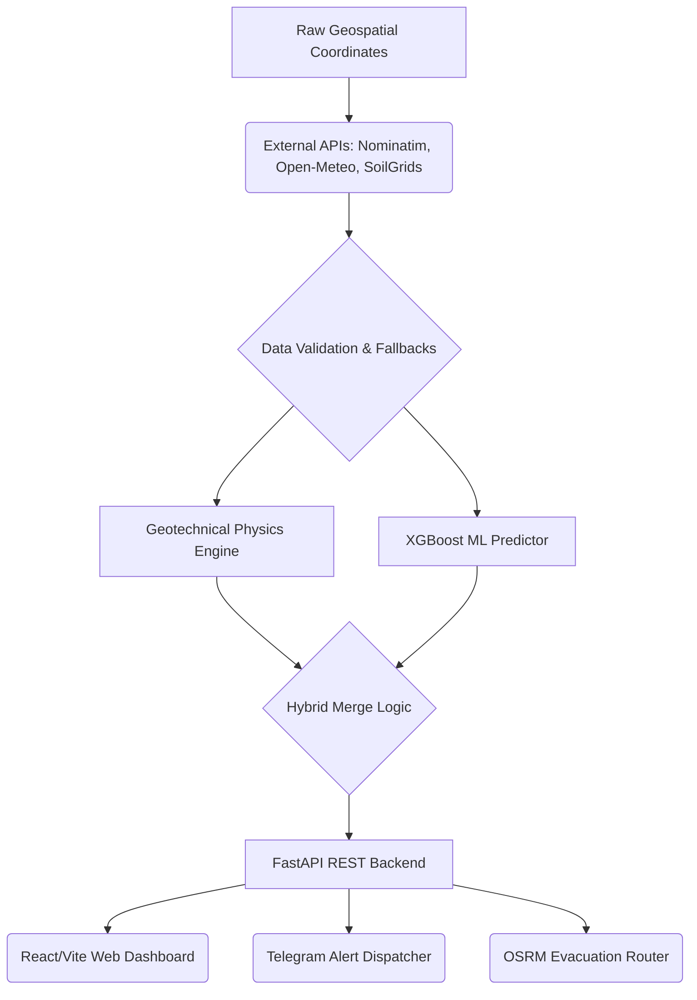

<div align="center">

# ⛰️ GeoShield Enterprise
### *AI-Powered Landslide Intelligence & Geotechnical Command Center*

[](https://opensource.org/licenses/MIT)
[](https://www.python.org/)
[](https://fastapi.tiangolo.com/)
[](https://xgboost.readthedocs.io/)
[](https:/landslide-monitoring-fxg3mupv7-tahas-projects-28481ad1.vercel.app)

<p align="center">
  An industry-grade, production-ready geospatial command center ingesting live satellite telemetry, soil composition dynamics, and digital elevation models (DEM) to evaluate landslide hazards via a <b>Hybrid Machine Learning and Geotechnical Physics Engine</b>.
</p>

[🎥 Live Video Demo](#-live-video-demonstration) • [📊 Dashboard](#-command-center-dashboard) • [🌟 Features](#-key-features) • [🛠️ Tech Stack](#%EF%B8%8F-technology-stack) • [🏗️ Architecture](#%EF%B8%8F-system-architecture) • [🚀 Quickstart](#-quick-start-guide) • [🔌 API Reference](#-core-api-endpoints)

</div>

---

<h2 align="center">🎥 Live Video Demonstration</h2>

<p align="center">
  <i>Continuous live platform walkthrough demonstrating real-time telemetry processing, slope dynamics, and instantaneous risk computation.</i>
</p>

<div align="center">
  
</div>

<p align="center">
  <sub>🎬 <i>If the GIF does not render immediately, <a href="https://github.com/helloAi0/landslide-monitoring/blob/main/frontend/src/assets/video.mp4">click here to open the raw MP4 video file</a>.</i></sub>
</p>

---

<h2 align="center">📊 Command Center Dashboard</h2>

<p align="center">
  <i>High-resolution geospatial command interface displaying regional hazard radar, safety thresholds, and telemetry analytics.</i>
</p>

<div align="center">
  
</div>

---

<h2 align="center">🌟 Key Features</h2>

<div align="center">

| Feature | Description |
| :--- | :--- |
| 🧠 **Hybrid ML & Physics Engine** | Fuses an XGBoost classification model with a Geotechnical Factor of Safety (FoS) equation to guarantee dynamic readings across all terrain profiles. |
| 📡 **Live Automated Telemetry** | Fetches real-time 3D/7D precipitation from Open-Meteo and deep soil composition metrics (clay, sand, bulk density) via ISRIC SoilGrids. |
| 🚨 **Automated Telegram Alerts** | Deploys instant, formatted markdown warnings to registered Telegram channels when catastrophic failure probability exceeds safety thresholds. |
| 🗺️ **Evacuation Routing (OSRM)** | Generates instantaneous, safe geospatial escape routes away from high-risk sectors using the OpenSource Routing Machine (OSRM) API. |
| 🛡️ **Fail-Safe Fallbacks** | Intelligent API timeout handling ensures the system degrades gracefully, maintaining realistic baseline calculations without crashing. |

</div>

---

<h2 align="center">🛠️ Technology Stack</h2>

<div align="center">

| Layer | Technologies |
| :--- | :--- |
| **Backend API** | Python 3.11+, FastAPI, Pydantic v2, Uvicorn, AsyncIO |
| **ML & Physics Engine** | XGBoost, Scikit-Learn, NumPy, Pandas, Joblib, Geotechnical LEM Calculus |
| **Telemetry & Telematics** | Open-Meteo API, ISRIC SoilGrids v2.0, OpenStreetMap (Nominatim), OSRM |
| **Web Frontend** | React 19, TypeScript, Vite, Leaflet GIS, Glassmorphism UI, Tailwind CSS |
| **Alert Systems** | Telegram Bot API (Automated Background Dispatch) |
| **Testing** | Pytest, AnyIO, Pytest-AsyncIO (18 unit & integration tests) |
| **DevOps & Infrastructure** | Docker, Docker Compose, GitHub Actions CI/CD |

</div>

---

<h2 align="center">🏗️ System Architecture</h2>



---

<h2 align="center">🚀 Quick Start Guide</h2>

### Option A: Local Development Setup

#### 1. Clone the Repository
```bash
git clone https://github.com/helloAi0/landslide-monitoring.git
cd landslide-monitoring
```

#### 2. Backend Setup (FastAPI)
```bash
# Create and activate virtual environment
python -m venv venv

# Windows (PowerShell):
.\venv\Scripts\activate

# Linux / macOS:
source venv/bin/activate

# Install dependencies
pip install -r requirements.txt
cp .env.example .env

# Start backend server
uvicorn main:app --host 127.0.0.1 --port 8000 --reload
```
* **API Documentation (Swagger UI):** `http://127.0.0.1:8000/docs`

#### 3. Web Client Setup (React + Vite)
```bash
cd frontend
npm install
npm run dev
```
* **Dashboard URL:** `http://localhost:5173`

---

### Option B: Docker Compose Setup

```bash
cp .env.example .env
docker compose up -d --build
```

---

### 🧪 Running Test Benchmarks

```bash
python -m pytest tests/ -v
```

```plaintext
======================== 18 passed, 0 warnings in 0.42s ========================
```

---

<h2 align="center">🔌 Core API Endpoints</h2>

<div align="center">

| Method | Endpoint | Description |
| :--- | :--- | :--- |
| `GET` | `/api/health` | Verifies system operational status, model state, and external API connectivity. |
| `POST` | `/api/predict-location` | Ingests lat/lon coordinates, auto-fetches live soil/meteorological telemetry, and outputs hybrid risk metrics. |
| `POST` | `/api/evacuation-route` | Generates optimal driving evacuation polylines and distance markers via OSRM. |

</div>

### 🌐 Data & Infrastructure Attributions

* **Open-Meteo Historical Weather API:** High-resolution precipitation and meteorological forecast models — [open-meteo.com](https://open-meteo.com).
* **ISRIC SoilGrids v2.0:** Global 250m resolution soil property data (clay, sand, silt, bulk density) — [isric.org](https://isric.org).
* **OpenStreetMap & Nominatim:** Open geospatial reverse geocoding and terrain naming infrastructure — [openstreetmap.org](https://openstreetmap.org).
* **OSRM (Open Source Routing Machine):** High-performance routing engine for shortest path evacuation calculation.

---

## 📄 License

Distributed under the MIT License. See `LICENSE` for more information.